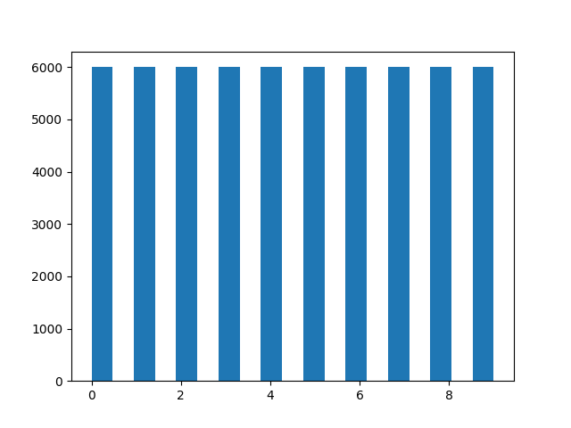

# mnist_fashion

## Objectif

Ce projet vise à comparer les performances de différents modèles de Machine Learning pour la classification d'images de vêtements. Vous utiliserez le jeu de données Fashion MNIST de Keras, qui contient des images de vêtements et accessoires.

## Méthodes

### Machine Learning classique (scikit-learn)

- Entraîner un modèle de classification (ex: SVM, Random Forest) sur les caractéristiques extraites.

### Réseau de neurones denses (Keras)

- Créer un réseau de neurones avec des couches denses (fully connected).

### Réseau de neurones convolutif (CNN - Keras)

- Créer un CNN avec des couches convolutives et de pooling.

## Instructions

### Récupérer le dépôt

Clonez le dépôt GitHub en utilisant la commande suivante :

```bash
git clone https://github.com/votre-utilisateur/mnist_fashion.git
```

### Créer un environnement virtuel

Créez un environnement virtuel pour isoler les dépendances du projet :

```bash
python -m venv .venv
```

### Activer l'environnement virtuel

```bash
Sur Windows :
.venv\Scripts\activate
```

```bash
Sur macOS et Linux :
source .venv/bin/activate
```

### Installer les librairies nécessaires

- Installez les dépendances nécessaires en utilisant le fichier requirements.txt :

```bash
pip install -r requirements.txt
```

- Librairies à installer
- Les principales librairies utilisées dans ce projet sont :

``tensorflow``
``scikit-learn``
``matplotlib``
``numpy``

### Exécution des scripts

Pour exécuter les différents scripts, utilisez les commandes suivantes :

- Modèle de Machine Learning classique (Random Forest) :

```python models/model_sl.py```

- Réseau de neurones denses (Keras) :

```python models/model_keras.py```

- Réseau de neurones convolutif (CNN - Keras) :

```python models/model_cnn.py```

### Résultats

Les résultats des modèles seront sauvegardés dans le dossier ../rapports sous forme de fichiers texte contenant les rapports de classification.

[rapport random Forest](/rapport/classification_report_rf_20241219_152323.txt)

[rapport keras simple](/rapports/classification_report_keras_20241219_163404.txt)

[rapport cnn](/rapports/classification_report_cnn_20241219_164650.txt)

### graphiques




# Comparaison des performances

| Classe | Précision (RF) | Rappel (RF) | F1-Score (RF) | Précision (Keras) | Rappel (Keras) | F1-Score (Keras) | Précision (CNN) | Rappel (CNN) | F1-Score (CNN) |
|--------|----------------|-------------|---------------|-------------------|----------------|------------------|----------------|--------------|----------------|
| 0      | 0.82           | 0.86        | 0.84          | 0.74              | 0.86           | 0.80             | 0.85           | 0.87         | 0.86           |
| 1      | 1.00           | 0.96        | 0.98          | 0.99              | 0.95           | 0.97             | 0.99           | 0.99         | 0.99           |
| 2      | 0.78           | 0.80        | 0.79          | 0.72              | 0.77           | 0.74             | 0.86           | 0.90         | 0.88           |
| 3      | 0.88           | 0.91        | 0.89          | 0.82              | 0.91           | 0.86             | 0.91           | 0.92         | 0.91           |
| 4      | 0.77           | 0.82        | 0.79          | 0.70              | 0.84           | 0.76             | 0.84           | 0.87         | 0.86           |
| 5      | 0.97           | 0.96        | 0.97          | 0.97              | 0.96           | 0.96             | 0.99           | 0.98         | 0.98           |
| 6      | 0.71           | 0.60        | 0.65          | 0.78              | 0.38           | 0.51             | 0.78           | 0.68         | 0.73           |
| 7      | 0.93           | 0.95        | 0.94          | 0.94              | 0.96           | 0.95             | 0.94           | 0.98         | 0.96           |
| 8      | 0.96           | 0.97        | 0.97          | 0.96              | 0.97           | 0.97             | 0.98           | 0.98         | 0.98           |
| 9      | 0.95           | 0.95        | 0.95          | 0.96              | 0.96           | 0.96             | 0.98           | 0.95         | 0.97           |
| **Accuracy** | **0.88**    |             |               | **0.86**          |                |                  | **0.91**       |              |                |
| **Macro Avg** | **0.88**    | **0.88**    | **0.88**      | **0.86**          | **0.86**       | **0.85**         | **0.91**       | **0.91**     | **0.91**       |
| **Weighted Avg** | **0.88** | **0.88**    | **0.88**      | **0.86**          | **0.86**       | **0.85**         | **0.91**       | **0.91**     | **0.91**       |

---

## Analyse des résultats

### Précision globale (Accuracy):

- Le modèle **CNN** (0.91) a la meilleure précision globale, suivi par le modèle **Random Forest** (0.88) et le modèle **Keras dense** (0.86).

### Macro Average:

- Le modèle **CNN** a également les meilleures moyennes macro pour la précision, le rappel et le F1-score (0.91), ce qui indique une performance plus équilibrée sur toutes les classes.

### Weighted Average:

- Le modèle **CNN** a les meilleures moyennes pondérées pour la précision, le rappel et le F1-score (0.91), ce qui confirme sa performance supérieure sur l'ensemble des classes.

### Classes individuelles:

- Pour la plupart des classes, le modèle **CNN** surpasse les autres modèles en termes de précision, rappel et F1-score.
- Le modèle **Random Forest** a des performances compétitives, mais légèrement inférieures à celles du CNN.
- Le modèle **Keras dense** a des performances inférieures, en particulier pour les classes 2, 4 et 6.

---

## Conclusion

Le modèle **CNN (Keras)** offre les meilleures performances globales pour la classification des images de vêtements du jeu de données Fashion MNIST. Il surpasse les modèles **Random Forest** et **Keras dense** en termes de précision, rappel et F1-score. 

- Pour des applications nécessitant une haute précision et une bonne généralisation, le modèle **CNN** est recommandé.  
- Le modèle **Random Forest** peut être une alternative viable si la simplicité et l'interprétabilité sont des priorités.
